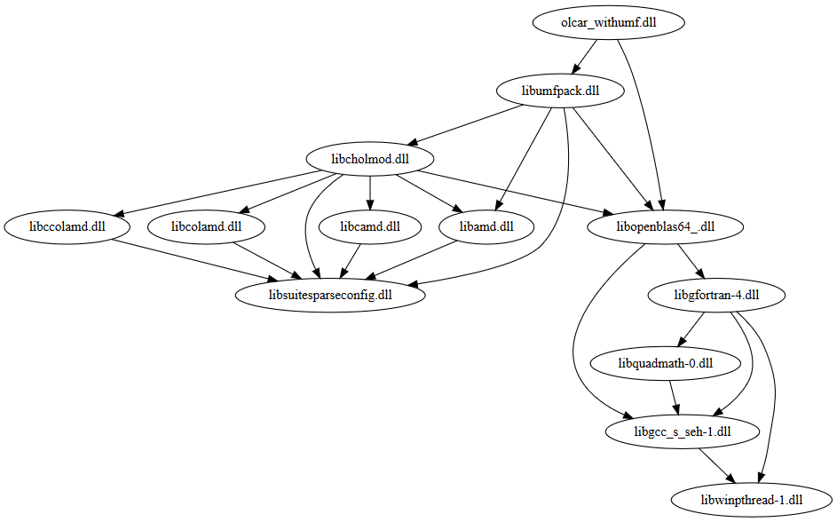

# olca-rust



`olca-rust` provides [JNI bindings](https://en.wikipedia.org/wiki/Java_Native_Interface)
for high performance math libraries that are used in
[openLCA](https://github.com/GreenDelta/olca-app) where the glue code is written
in [Rust](https://www.rust-lang.org/). Currently, we support calls into
[OpenBLAS](https://github.com/xianyi/OpenBLAS) and [UMFPACK](https://github.com/PetterS/SuiteSparse)
and we take pre-compiled versions of these libraries for the respective platforms
directly from the [Julia](https://julialang.org/) distribution packages.

## Building from source
In order to build the JNI bindings, you need to have a Rust toolchain (with
`ructc`, `cargo`, and a platform specific linker) installed. The respective
platform entry in the `config` file needs to point to a folder where the OpenBLAS
and UMFPACK libraries including all dependencies can be found (typically, we use
the library folder of a Julia installation for this). This project contains a
`build.bat` script for Windows and a `build.sh` script for Linux and macOS for
running the build on these platforms.

On Windows, the build script first [generates lib-files](https://stackoverflow.com/a/16127548/599575)
for each library we want to link against. This is done automatically from the
definition files in the `windefs` folder but it requires that the `lib` tool
from the MSVC 2017 build tools (which are anyhow required for the Rust compiler)
is in your `PATH` (e.g. something like this:
`C:\Program Files (x86)\Microsoft Visual Studio\2019\BuildTools\VC\Tools\MSVC\14.24.28314\bin\Hostx64\x64`).

The build scripts should then generate the libraries (`olcar.{dll|so|dylib}`
with BLAS & LAPACK bindings and `olcar_withumf.{dll|so|dylib}` with additional
UMFPACK bindings in the `bin` folder.

## The `deps.py` script
For managing the dependencies and generating distribution packages, this project
contains a `deps.py` script that can be executed with Python 3.6+ and takes
a command as argument:

```bach
python3 deps.py [command]
```

The following commands are currently supported:

* `collect`: collects the dependencies and prints them on the console
* `sync`: copies missing dependencies to the `bin` folder
* `dist`: generates the distribution packages
* `java`: generates the Java code for loading the dependencies in
  the correct order
* `viz`: prints the dependency graph in dot-format that can be 
  visualized with tools like Graphviz/Webgraphviz (like the image above)
* `clean`: deletes the contents of the `bin` and `dist` folders

The `deps.py` script uses the following tools to collect the dependencies:

* Linux: `ldd`
* macOS: `otool`
* Windows: the command line version of the [Dependencies](https://github.com/lucasg/Dependencies) tool which needs to
  be available in the system path

## Running the test suite
The `java` folder contains a Maven project that tests the JNI bindings against
the interface of the [openLCA modules](https://github.com/GreenDelta/olca-modules).
If the openLCA modules are installed, you can run the test suite via:

```bash
mvn -f java/pom.xml test -Dolca.libdir=../bin
```

With the `-Dolca.libdir` parameter you can pass the library folder into the
test suite, e.g. to test the library without UMFPACK bindings:

```bash
mvn -f java/pom.xml test -Dolca.libdir=../dist/wo_umfpack
```

This should log something like:

```
...
... Math libraries loaded without UMFPACK support.
```
